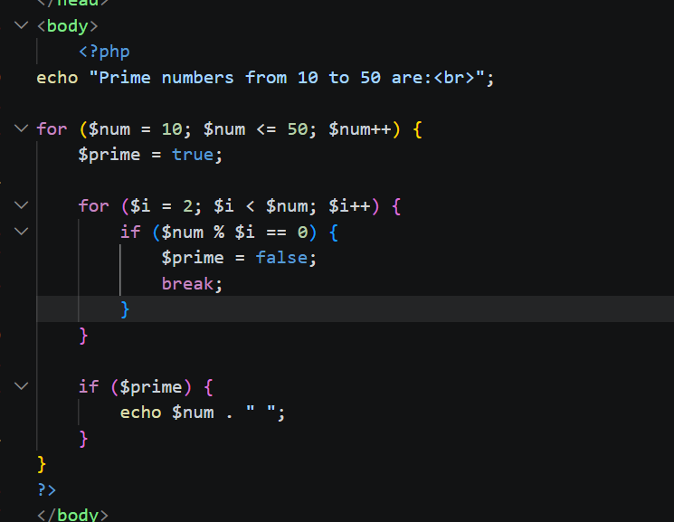
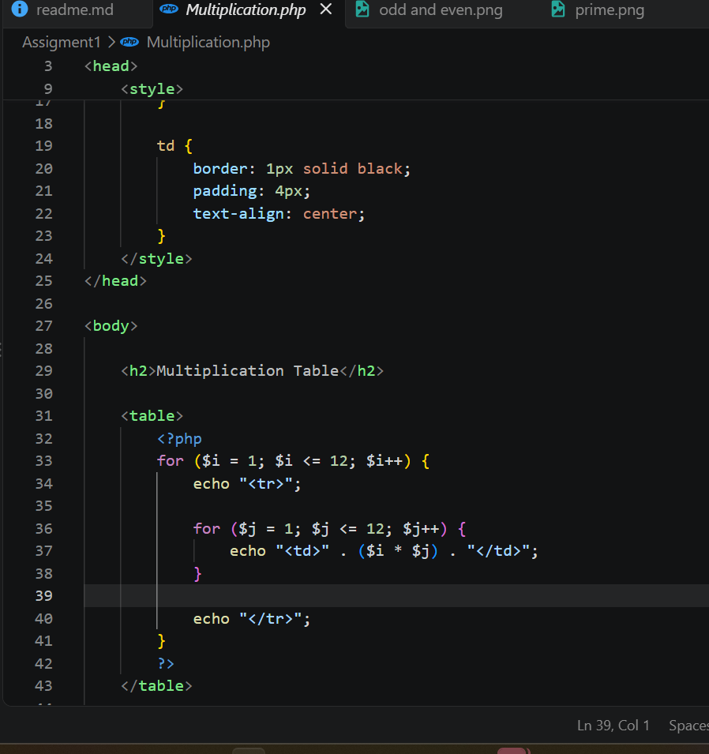

1. Find prime numbers from 10 to 50
2. Display odd numbers from 2 to 20
3. Display even numbers from 35 down to 7
4. Create a 12 × 12 multiplication table

1. Prime Numbers from 10 to 50
A prime number is a number greater than 1 that can only be divided exactly by:

2. Odd Numbers from 2 to 20
This program checks numbers from:2 to 20
display odd

 Even Numbers from 35 Down to 7

4. Multiplication Table

This program creates a **12 × 12 multiplication table**.

It uses two for loops.

This is called a:

Nested Loop

A nested loop means:One loop is inside another loop.

