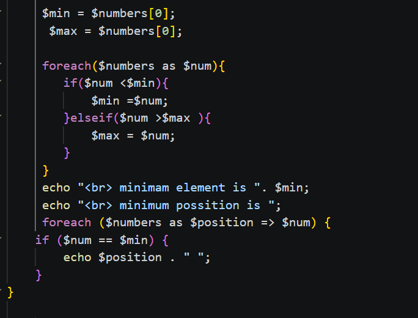
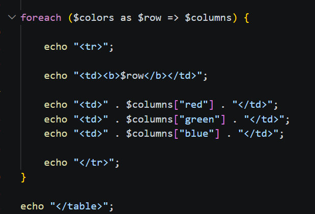
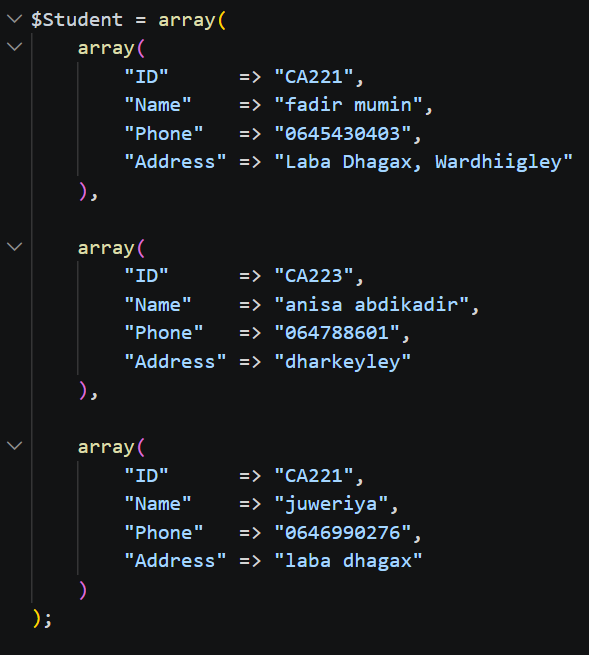

Array assigment 

in php array 
q1 One Dimension array

declares an array of one dimension, initialize it to the following values: 
(5, -7, 12, 10, -7, 11, -6, 12, 1, -7, 2, 9) 

1_Print all elements of the array
$numbers = array(5, -7, 12, 10, -7, 11, -6, 12, 1, -7, 2, 9);
     echo "    diplay all elemnts of array  ";

    foreach($numbers as $num){
        echo $num . "";
    }       

     echo " ";
     echo "  Calculate and print total of all elements ";

2_ Initialize the totals
$total = 0;
$evenTotal = 0;
$oddTotal = 0;

These variables start from 0.

$total → stores the total of all elements.
$evenTotal → stores the total of even elements.
$oddTotal → stores the total of odd elements.

foreach($numbers as $num){

The foreach loop takes each number from the $numbers array one by one.

3_Calculate the total of all elements
$total = $total + $num;

Each number is added to $total.

For example:

0 + 5 = 5
5 + (-7) = -2
-2 + 12 = 10.

4_ Check even numbers
if($num % 2 === 0){
    $evenTotal = $evenTotal + $num;
}

% is used to find the remainder after division by 2.

If the remainder is 0, the number is even, so it is added to $evenTotal.

The even numbers are:

12, 10, -6, 12, 2

Their total is:30.

5_ Calculate odd numbers
else{
    $oddTotal = $oddTotal + $num;
}

If the number is not even, it goes to else and is added to $oddTotal.

The odd numbers are:

5, -7, -7, 11, 1, -7, 9

Their total is:15.

6_ Display the results
echo "   total of all element is ". $total;
echo "  total of all event is " . $evenTotal;
echo "  total os all odd is " . $oddTotal;

These lines print the three results:

Total of all elements = 35
Total of even elements = 30
Total of odd elements = 5

 

Find minimum element and its positions and  
Find maximum element and its positions 

1_Set the Initial Minimum and Maximum
$min = $numbers[0];
$max = $numbers[0];

2_Find the Minimum and Maximum

foreach($numbers as $num){
    if($num < $min){
        $min = $num;
    }
    elseif($num > $max){
        $max = $num;
    }
}

The foreach loop checks each number in the array.

If the current number is smaller than $min, it becomes the new
minimum.

If the current number is bigger than $max, it becomes the new maximum.

3_ Display the Minimum

echo "  minimam element is ". $min;

This prints the minimum element found in the array.

4_ Find the Positions of the Minimum

echo "  minimum possition is ";

foreach ($numbers as $position => $num) {
    if ($num == $min) {
        echo $position . " ";
    }
}

$position = the index of the element
$num = the value of the element

5_Display the Maximum

echo " Maximum element: " . $max;

This prints the maximum element found in the array.

6_Find the Positions of the Maximum

echo " Maximum positions: ";

foreach ($numbers as $position => $num){
    if($num == $max){
        echo $position . "";
    }
}
 

Q2  associative array of two dimensions 

The $colors variable contains three main categories:

Light
Normal
Dark

Each category contains three colors:

Red
Green
Blue

The PHP foreach loop is used to read the array data and display it in an HTML table.

1. Array

An array stores multiple values in one variable.

$colors = array(...);
2. Multidimensional Array

An array inside another array.

"Light" => array(
    "red" => "light red"
)
3. Associative Array

The array uses named keys instead of numeric indexes.

"red" => "light red"

Here:

red = key
light red = value
4. foreach

foreach is used to loop through an array.

foreach ($colors as $row => $columns)

It gets each category and its inner array.

foreach ($colors as $row => $columns)
$row

Contains the main category:

Light
Normal
Dark
$columns

Contains the colors inside each category:

red
green
blue

For example:

$columns["red"]

returns:

light red

when $row is Light.

Q3:

The student information includes:
Student ID
Student Name
Phone Number
Address

Each student is represented by an associative array.

For example:

array(
    "ID" => "CA221",
    "Name" => "fadir mumin",
    "Phone" => "0645430403",
    "Address" => "Laba Dhagax, Wardhiigley"
)
The keys are:

ID
Name
Phone
Address

Each key has a corresponding value.

For example:

$row["Name"]

returns the student's name.

Each student is represented by an associative array.

important concept

1. Array

An array stores multiple values in one variable.

$Student = array(...);
2. Multidimensional Array

An array that contains other arrays.

$Student = array(
    array(...),
    array(...),
    array(...)
);
3. Associative Array

An array that uses named keys.

"Name" => "fadir mumin"

Here:

Name = key
fadir mumin = value
4. Foreach

foreach is used to repeat an operation for every item in an array.

foreach ($Student as $row)
5. Array Access

We can access a value using its key:

$row["Name"]
$row["Phone"]
$row["Address"]
