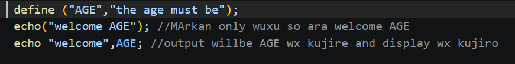

PHP Practice Concepts - week One

this folder  contains  week 1  practice from the course php

TOPIC COVERED

1. PHP Introduction

.what is php ?
.How php  works with a web server ?
.php file Extention .php 
.Basic php  syntax
.How to run php using XAMPP
.diffrent Echo and print

2. Echo and Print

I learned how to display output in PHP using:

.echo
.print

Example:

<?php

  print "welcome to php ";
  echo "hello word";

?>

3. syntax of Variable

I learned how to create and use variables in PHP.

Example:
<?php

$name="anisa";
echo  "my name is $name";

?>

4. If, Elseif and Else

I learned how to make decisions using conditional statements.

Example:

<?php

  $Age =20;
    $Grade =4;

    if($Age > 20);
        elseif ($Grade <2)

        echo "poor";

    else
        echo "adualt";

    if($Age >20){

    }elseif ($Grade <2)
    echo "poor";
    else
        echo "adualt";

        ?>

5. Switch Statement

I learned how to use switch to check different values.

Example:

<?php

   $Marks = 87;

    switch ($Marks>=90)
    {
        echo "excellent";
        break;
        case $Marks >=80:
        echo "very good";
        case ($Marks >=50)
        echo "minimal pass";

        default :
                echo "not pass";

    }
    
?>

Screenshot Concept

display output use echo and print 

 Constant : A constant is a value that cannot be changed after it has been defined.

Switch: statement is used to execute different code depending on a value.

If, Elseif and Else: if, elseif, and else are used to make decisions based on conditions

