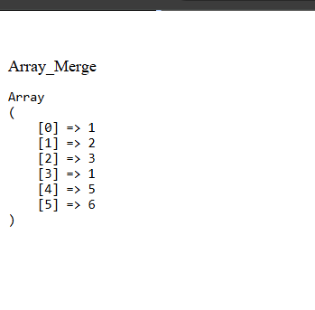
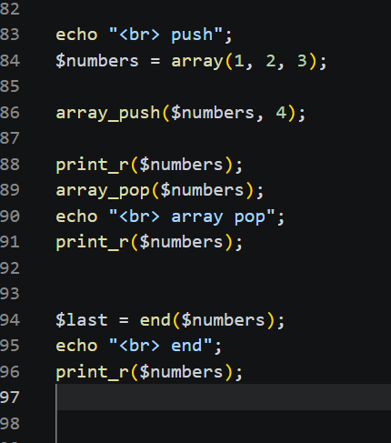
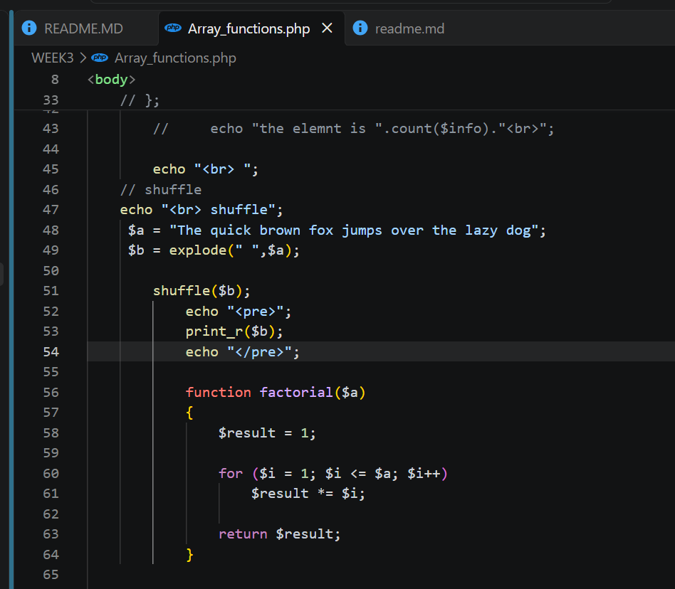

# PHP Array Functions

This project demonstrates different PHP array functions, including:

array_merge()
array_reverse()
array_push()
array_pop()
end()
print_r()
explode()
shuffle()

1. array_merge()
array_merge() is used to combine two or more arrays into one array.

.png)

 2. array_reverse()

array_reverse() returns an array in the opposite order.

3. array_push()
array_push() adds one or more elements to the end of an array.

4. array_pop()
array_pop() removes the last element from an array.

5. end()
end() moves the array's internal pointer to the last element and returns that element.

 6. print_r()
print_r() is commonly used to display the contents of an array in a readable format.

! [fuctionsOutput] (../Screenshot//fuctinOutput.png)

7. explode()
explode() is used to split a string into an array based on a separator.

7. shuffle()
shuffle() randomly changes the order of the elements in an array.

![shuffle output] (../Screenshot//shuffle.png)